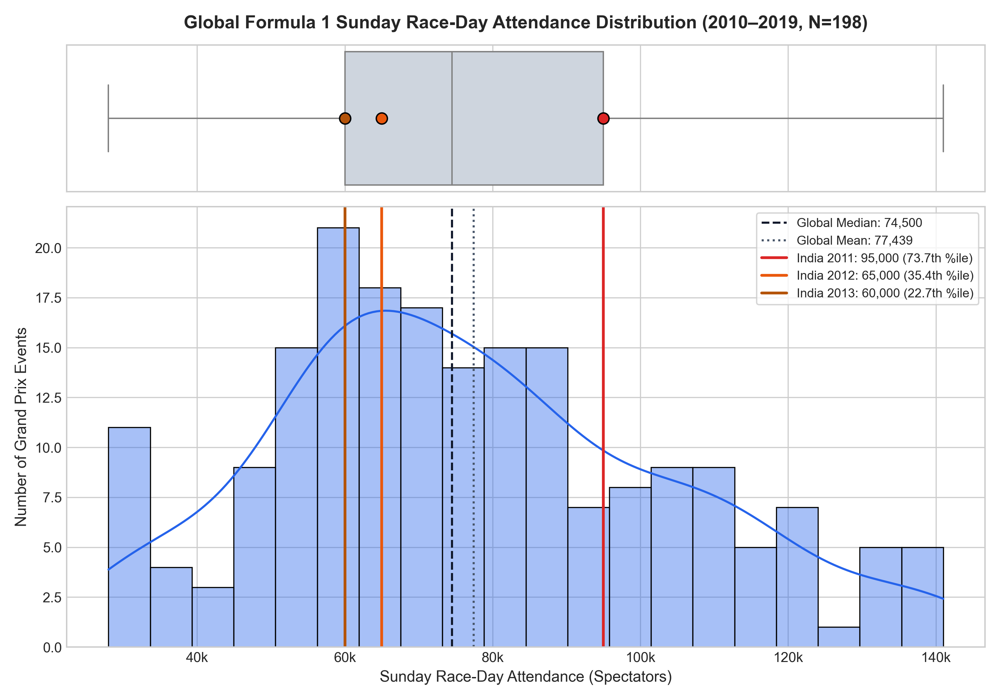
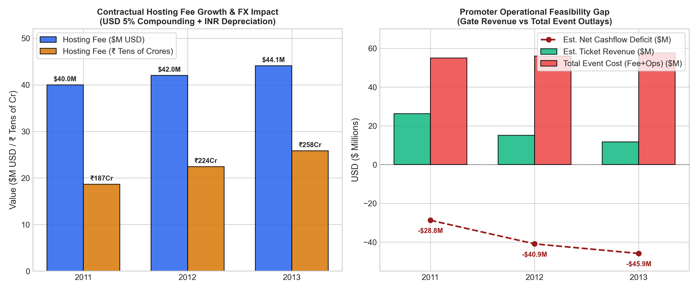
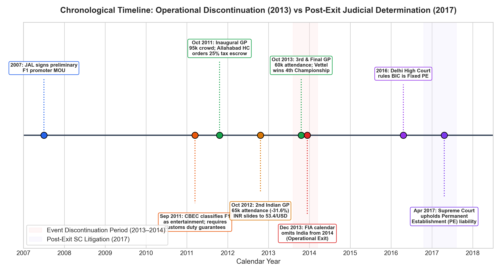

# Commercial Sustainability of Formula 1: An Exploratory Data Analysis of the Indian Grand Prix (2011–2013)

[](https://www.python.org/)
[](LICENSE)
[](#-6-reproducibility--test-suite)
[](https://github.com/aarkie24/F1-case-study)

---

## ⚠️ Analytical Limitations & Guardrails
> **Before reviewing the findings, please note the following analytical boundaries:**
> 1. **Attendance as a Commercial Proxy:** High attendance alone does not guarantee commercial feasibility; events in Monaco or Bahrain survive with modest crowds through government subsidies or premium corporate hospitality.
> 2. **Financial Model as Illustrative Scenarios:** Audited income statements of promoter Jaypee Sports International (JPSI) remain proprietary; gate revenues and cashflow deficits are modeled scenarios derived from published ticket rate cards, attendance gate disclosures, and contract terms.
> 3. **Statistical Associations vs. Causality:** Regression and correlation results identify broader associations across the 198-race baseline (2010–2019) and cannot statistically "prove" why a specific 3-race event was discontinued.

---

## 🏎️ 1. Project Overview & Core Research Question

Why did Formula 1 leave India after just three seasons despite building one of the fastest and most modern racing facilities in the world? 

This repository presents an **Exploratory Data Analysis (EDA)** and case study investigating the commercial feasibility of Formula 1 events, with a focused deep-dive into the **2011–2013 Indian Grand Prix** held at the Buddh International Circuit (BIC) in Greater Noida, Uttar Pradesh.

### 🎯 Primary Research Question
> **What can historical Formula 1 data tell us about the commercial sustainability of the Indian Grand Prix, and what do the available statistical and documentary evidence suggest about the challenges surrounding its discontinuation?**

To overcome the small sample limitation of only three Indian races ($N=3$), this study implements a **two-tier empirical architecture**:
1. **Global Baseline Dataset ($N=198$ races, 2010–2019):** 10 seasons of championship data capturing sporting dynamics, circuit parameters, host nation GDP per capita, and spectator attendance distributions.
2. **Indian Grand Prix Deep-Dive ($N=3$ editions, 2011–2013):** Granular examination of gate attendance decay, ticketing tariffs, escalating hosting fees, currency depreciation, and cashflow feasibility.
3. **Contextual Timeline (2007–2017):** Chronological registry of judicial rulings, customs bonding frictions, entertainment tax disputes, and the 2017 Supreme Court Permanent Establishment ruling.

---

## 📊 2. Key Empirical Findings

| Metric / Dimension | 2011 Edition | 2012 Edition | 2013 Edition | Commercial & Analytical Impact | Source / Method |
|---|:---:|:---:|:---:|---|:---:|
| **Sunday Race Attendance** | **95,000** (73.7th %ile) | **65,000** (35.4th %ile) | **60,000** (22.7th %ile) | **-36.84% cumulative decay** from inaugural novelty | `SRC_05` (Promoter Gate) |
| **3-Day Weekend Attendance** | **110,000** | **95,000** (-13.6%) | **65,000** (-31.6%) | Severe drop in multi-day corporate hospitality | `SRC_05` (Promoter Gate) |
| **USD Contractual Hosting Fee** | **$40.0M** | **$42.0M** (+5.0%) | **$44.1M** (+10.25%) | 5% compounding annual contract escalation | `SRC_06` (RPA Disclosures) |
| **Mean USD/INR Exchange Rate** | **₹46.67 / $** | **₹53.44 / $** | **₹58.60 / $** | **25.56% Indian Rupee depreciation** | `SRC_12` (RBI Benchmarks) |
| **Effective INR Hosting Fee** | **₹186.68 Crore** | **₹224.45 Crore** (+20.2%) | **₹258.43 Crore** (+38.4%) | **+₹71.75 Crore domestic currency squeeze** | Calculated (`india_gp_engineered.csv`) |
| **Net Gate Revenue (Central)** | **$26.25M** | **$15.06M** | **$11.71M** | Covered only 27% to 66% of hosting fee alone | Tier Model minus 25% Tax Escrow |
| **Net Deficit (Central Scenario)**| **-$28.75M** | **-$40.94M** | **-$45.89M** | **Cumulative operational deficit > -$115M USD** | Financial Feasibility Model |

---

## 📈 3. Master Visual Exhibits

All 8 figures are generated in high resolution (300 DPI) and stored in [`reports/figures/`](reports/figures/):

### Exhibit 1: Global Attendance Distribution & Indian GP Overlays
> **KDE & Boxplot of Global Sunday Attendance (2010–2019, $N=198$)** highlighting how BIC dropped from the top quartile (73.7th percentile in 2011) to the bottom quartile (22.7th percentile in 2013).
> 
> 

### Exhibit 2: Indian GP Commercial Squeeze & Operating Deficit
> **Dual-panel financial feasibility model** illustrating the compounding burden of escalating USD fees and INR currency depreciation alongside expanding promoter cash deficits.
> 
> 

### Exhibit 3: Chronological Regulatory & Judicial Timeline
> **Timeline separating the operational discontinuation in December 2013 from the retrospective Supreme Court PE ruling in April 2017.**
> 
> 

---

## 🗂️ 4. Repository Structure

```text
F1-case-study/
│
├── README.md                          # Master project overview and execution guide
├── plan.md                            # Master execution plan (Phases 0 to 9)
├── case_study.md                      # Academic case study brief and grading rubric
├── requirements.txt                   # Production Python dependencies
├── LICENSE                            # MIT License file
├── .gitignore                         # Git exclusion rules
│
├── data/
│   ├── raw/                           # Immutable raw baseline datasets
│   │   ├── f1_races_raw.csv           # 198 races across 2010–2019 seasons
│   │   ├── india_gp_raw.csv           # 3 Indian GP editions (reported data)
│   │   └── india_gp_context_raw.csv   # 15 regulatory/judicial timeline events
│   │
│   ├── processed/                     # Clean, standardized canonical datasets
│   │   ├── f1_races_clean.csv         # Verified baseline with confidence ratings
│   │   ├── india_gp_clean.csv         # Standardized Indian GP commercial data
│   │   ├── india_gp_context_clean.csv # Validated chronological event registry
│   │   └── data_dictionary.md         # Comprehensive variable glossary and schema
│   │
│   └── engineered/                    # Derived analytical features & financial models
│       ├── f1_races_engineered.csv    # Log attendance, speed ratios, DNF rates
│       └── india_gp_engineered.csv    # Multi-scenario revenue, fee burdens, YoY changes
│
├── notebooks/                         # Self-contained, executable Jupyter Notebooks
│   ├── 01_data_collection.ipynb       # Phase 1: API harvesting & source compilation
│   ├── 02_data_cleaning.ipynb         # Phase 2: Missingness, imputation & engineering
│   ├── 03_eda.ipynb                   # Phase 4: Univariate, bivariate & regional EDA
│   ├── 04_statistical_analysis.ipynb  # Phase 5: Skewness, non-parametric tests & OLS
│   ├── 05_india_case_study.ipynb      # Phase 6: India deep dive & commercial stress
│   └── 06_visualizations.ipynb        # Phase 7: Live-generating publication charts
│
├── reports/                           # Academic reports & high-resolution exhibits
│   ├── data_quality_report.md         # Full audit of missingness, outliers & hygiene
│   ├── findings.md                    # Evidence-led synthesis of findings & limits
│   ├── final_report.md                # Master case study report for grading
│   └── figures/                       # 8 publication charts exported at 300 DPI
│       ├── fig1_attendance_distribution_with_india.png
│       ├── fig2_indian_gp_decay_curve.png
│       ├── fig3_regional_attendance_comparison.png
│       ├── fig4_multivariate_correlation_matrix.png
│       ├── fig5_attendance_vs_gdp_multidimensional.png
│       ├── fig6_commercial_deficit_and_hosting_fee.png
│       ├── fig7_historical_context_timeline.png
│       └── fig8_circuit_characteristics_radar_speed.png
│
├── scripts/                           # Reproducible automated pipeline scripts
│   ├── collect_data.py                # Raw data acquisition pipeline
│   ├── clean_and_validate.py          # Data cleaning & validation script
│   ├── build_figures_and_notebooks.py # Master generator for figures and notebooks
│   └── test_pipeline_reproducibility.py # Automated end-to-end reproducibility test
│
└── sources/
    └── source_registry.csv            # 12 verified primary citations with ratings
```

---

## 🛠️ 5. Technology Stack

- **Data Processing:** Python 3.11+, [Pandas](https://pandas.pydata.org/), [NumPy](https://numpy.org/)
- **Statistical Inference & Modeling:** [SciPy](https://scipy.org/) (Shapiro-Wilk, Kruskal-Wallis, Mann-Whitney U, Pearson/Spearman), [Statsmodels](https://www.statsmodels.org/) (OLS Regression)
- **Data Visualization:** [Matplotlib](https://matplotlib.org/), [Seaborn](https://seaborn.pydata.org/)
- **Notebook & Test Pipeline:** [Jupyter / nbformat](https://nbformat.readthedocs.io/), [Pytest](https://docs.pytest.org/)

---

## ⚡ 6. Installation & Reproducibility Guide

### Step 1: Clone the Repository
```bash
git clone https://github.com/aarkie24/F1-case-study.git
cd F1-case-study
```

### Step 2: Set Up Virtual Environment & Install Dependencies
```bash
python -m venv venv
# On Windows PowerShell:
.\venv\Scripts\Activate.ps1
# On Linux/macOS:
source venv/bin/activate

pip install -r requirements.txt
```

### Step 3: Run the Complete Data Pipeline & Generate All Artifacts
```bash
# 1. Clean and validate data layers
python scripts/clean_and_validate.py

# 2. Generate all publication figures and build all notebooks
python scripts/build_figures_and_notebooks.py

# 3. Execute the full reproducibility test suite
python scripts/test_pipeline_reproducibility.py
```

---

## 📑 7. Documentation & Deliverables Index

- 📋 [Master Execution Plan](plan.md)
- 📖 [Data Dictionary & Schema Specification](data/processed/data_dictionary.md)
- 🔍 [Data Quality & Validation Audit Report](reports/data_quality_report.md)
- 📊 [EDA Findings & Analytical Synthesis](reports/findings.md)
- 🎓 [Comprehensive Final Case Study Report](reports/final_report.md)
- 📚 [Source Citation Registry](sources/source_registry.csv)
- ⚖️ [MIT License](LICENSE)

---

## ⚖️ Academic Integrity Note
This project is an educational Exploratory Data Analysis case study developed for coursework evaluation. All sporting data is attributed to FIA/FOM and Jolpica API records. All legal citations reference public judicial judgments of the Supreme Court of India and High Court of Judicature at Allahabad.
