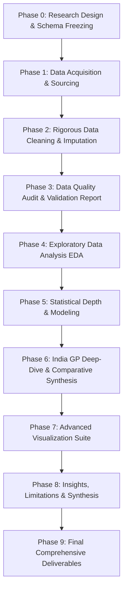

# Master Execution Plan: Commercial Sustainability of Formula 1 & The Indian Grand Prix Case Study

## 1. Executive Summary & Research Objectives

### Working Title
**An Exploratory Data Analysis of the Commercial Sustainability of Formula 1 Events: A Case Study of the Indian Grand Prix**

### Core Objective
This project implements a rigorous, two-tier Exploratory Data Analysis (EDA) investigating the commercial and event-level characteristics of Formula 1 races between 2010 and 2019. It uses the 2011–2013 Indian Grand Prix as a detailed case study to examine event sustainability, attendance trajectories, and commercial pressures, connecting quantitative statistical findings with documented contractual, taxation, and regulatory context.

### Research Questions
* **Primary RQ:** How did the commercial and event characteristics of the Indian Grand Prix compare with broader Formula 1 events (2010–2019), and what data-driven patterns help explain the challenges surrounding its sustainability?
* **RQ1 (Attendance Trajectory):** How did spectator attendance at the Buddh International Circuit evolve across 2011, 2012, and 2013?
* **RQ2 (Comparative Positioning):** How did Indian GP attendance, ticket pricing, and race dynamics benchmark against global and regional (Asian/non-European) races?
* **RQ3 (Event Characteristics & Attendance Drivers):** What circuit, sporting, and macroeconomic characteristics are statistically correlated with race attendance?
* **RQ4 (Commercial Pressure):** What documented hosting fees, operating costs, and revenue indicators characterize the commercial feasibility of the Indian GP?
* **RQ5 (Anomalies & Outliers):** Which variables, races, or seasons exhibit significant deviations or extreme values compared to the baseline population?
* **RQ6 (Contextual Integration):** How do quantitative findings align with documented regulatory events (customs status, entertainment tax disputes, and the subsequent 2017 Supreme Court permanent establishment ruling)?

---

## 2. Analytical Philosophy & Boundary Conditions

To maintain academic rigor and satisfy all rubric benchmarks:
1. **Separation of Evidence Levels:**
   * Level 1: *Direct Empirical Data* (what race and attendance numbers show).
   * Level 2: *Statistical Inferences* (correlations, distributional patterns, group differences).
   * Level 3: *Documentary Context* (legal judgments, government notifications, contract reports).
2. **Correlation vs. Causation:** Avoid simplistic assertions (e.g., "taxation killed the Indian GP"). Claims must state what data demonstrates alongside documentary records.
3. **Temporal Accuracy:** Strictly decouple the **event exit timeline (final race in 2013; dropped from 2014 calendar)** from the **subsequent legal timeline (Supreme Court Permanent Establishment ruling in 2017)**.
4. **Data Integrity:** Zero data fabrication; strictly tracked source registry; explicit imputation logs and outlier handling justifications.

---

## 3. Data Architecture & Schemas

```
┌─────────────────────────────────────────────────────────────────────────────┐
│                             DATA ARCHITECTURE                               │
├─────────────────────────────────────────────────────────────────────────────┤
│                                                                             │
│   ┌───────────────────────────┐         ┌───────────────────────────────┐   │
│   │   Dataset A: f1_races     │         │    Dataset B: india_gp        │   │
│   │   (2010-2019 Global Baseline) │         │    (2011-2013 Deep-Dive)      │   │
│   │   • ~190-200 Race Rows    │         │    • 3 Detailed Race Rows     │   │
│   │   • 20-25 Variables       │         │    • 15-20 Commercial Vars    │   │
│   └─────────────┬─────────────┘         └───────────────┬───────────────┘   │
│                 │                                       │                   │
│                 └───────────────────┬───────────────────┘                   │
│                                     ▼                                       │
│                     ┌───────────────────────────────┐                       │
│                     │ Dataset C: india_gp_context   │                       │
│                     │ (Timeline of Legal/Tax/Biz)   │                       │
│                     │ • 10-20 Chronological Events  │                       │
│                     └───────────────┬───────────────┘                       │
│                                     ▼                                       │
│                     ┌───────────────────────────────┐                       │
│                     │      source_registry.csv      │                       │
│                     │ (Full Provenance & Citations) │                       │
│                     └───────────────────────────────┘                       │
└─────────────────────────────────────────────────────────────────────────────┘
```

### 3.1. Dataset A — `f1_races.csv` (Global Baseline, 2010–2019)
* **Target Size:** ~190–200 rows, 20–25 attributes.
* **Fields:**
  * `race_id`, `season`, `round`, `race_name`, `circuit_id`, `circuit_name`, `country`, `city`, `continent`, `circuit_type` (permanent/street/hybrid).
  * `date`, `laps`, `circuit_length_km`, `race_distance_km`, `race_duration_min`, `average_speed_kmh`, `fastest_lap_time_s`.
  * `winner_driver`, `winning_constructor`, `winning_margin_s`, `finishers_count`, `dnf_count`, `total_pit_stops`.
  * `race_attendance`, `attendance_type` (Race Day / 3-Day Weekend), `attendance_source`, `attendance_confidence` (High/Medium/Low).
  * `gdp_per_capita_usd`, `event_tenure_years` (years on calendar).

### 3.2. Dataset B — `india_gp.csv` (India-Specific Case Study)
* **Target Size:** 3 rows (2011, 2012, 2013).
* **Fields:**
  * `season`, `round`, `date`, `official_race_name`, `circuit_name`.
  * `attendance_race_day`, `attendance_weekend`, `attendance_source`.
  * `hosting_fee_usd` (reported contract figure), `ticket_price_min_inr`, `ticket_price_max_inr`, `avg_ticket_price_usd`.
  * `estimated_ticket_revenue_usd`, `operating_cost_usd`, `promoter_name` (Jaypee Sports International).
  * `customs_duty_status`, `entertainment_tax_status`, `pe_litigation_status`.
  * `usd_inr_exchange_rate`, `data_confidence_score`.

### 3.3. Dataset C — `india_gp_context.csv` (Chronological Context Timeline)
* **Target Size:** 10–20 historical, regulatory, sporting, and judicial events.
* **Fields:** `event_id`, `date`, `year`, `category` (Taxation / Judicial / Contractual / Sporting / Promoter Financials), `headline`, `factual_description`, `source_citation`, `impact_dimension` (Financial / Regulatory / Operational), `verification_confidence`.

### 3.4. Source Registry — `source_registry.csv`
* **Fields:** `source_id`, `dataset`, `variable_affected`, `source_name`, `source_url`, `publication_date`, `access_date`, `source_type` (Official API / Government / Judicial Ruling / Financial Report / Industry Publication), `reliability_rating`, `notes`.

---

## 4. Phase-by-Phase Implementation Roadmap



### Phase 0: Research Design & Schema Freezing
* **Objective:** Define and freeze all variable definitions, units, types, and schema files.
* **Deliverables:**
  * `data_dictionary.md` containing all field specifications and confidence schemas.
  * Initialized `source_registry.csv`.

### Phase 1: Data Acquisition
* **Objective:** Collect raw data across all three dataset tracks without destructive modifications.
* **Sources & Methods:**
  * F1 Sporting Data (2010–2019): Jolpica F1 API (Ergast successor) for race schedules, circuit stats, results, pitstops, margins.
  * F1 Attendance: Official Formula 1 press releases, FOM reports, reputable motorsport industry publications (Autosport, RaceFans, BlackBook Motorsport).
  * Indian GP Financial & Regulatory Data: Supreme Court of India judgments (*Formula One World Championship Ltd vs CIT* 2017), Allahabad High Court filings, audited disclosures, and contemporary financial reporting (Economic Times, Business Standard, Mint).
  * Macroeconomic Context: World Bank / IMF indicators for GDP per capita and exchange rates.
* **Deliverables:**
  * `data/raw/f1_races_raw.csv`
  * `data/raw/india_gp_raw.csv`
  * `data/raw/india_gp_context_raw.csv`
  * Complete `sources/source_registry.csv` entries.

### Phase 2: Rigorous Data Cleaning & Standardization
* **Objective:** Clean, standardize, normalize, and validate raw datasets with full audit trails.
* **Tasks:**
  * **Duplicate & Key Integrity:** Verify uniqueness of `(season, round)` and `race_id`.
  * **Missing Value Analysis:** Distinguish between *structural missingness*, *unrecorded historical data*, and *data collection gaps*.
  * **Imputation Protocol:** Apply documented median or group-based (regional/circuit-type) imputation only where statistically justified; preserve explicit `NA` for non-imputable metrics.
  * **Unit & Currency Standardization:** Convert all speeds to km/h, durations to minutes, distances to km, and historical INR figures to USD using historical period exchange rates.
  * **Outlier Auditing:** Detect outliers via IQR (1.5x IQR) and Z-score ($|z| > 3$); investigate and classify as genuine unusual races vs data anomalies without blind dropping.
* **Deliverables:**
  * `data/processed/f1_races_clean.csv`
  * `data/processed/india_gp_clean.csv`
  * `data/processed/india_gp_context_clean.csv`

### Phase 3: Data Quality Audit & Validation
* **Objective:** Verify data integrity before exploratory and statistical modeling.
* **Checks:**
  * Schema conformity and missingness percentage table.
  * Distribution consistency checks (minimums, maximums, logical boundary checks).
  * Temporal continuity validation across 2010–2019 seasons.
* **Deliverables:**
  * `reports/data_quality_report.md`

### Phase 4: Exploratory Data Analysis (EDA)
* **Objective:** Uncover core patterns, distributions, and trends across the global baseline.
* **Analysis Tracks:**
  * **Univariate:** Central tendency (mean, median), dispersion (standard deviation, IQR), shape (skewness, kurtosis) across numerical variables (attendance, speed, winning margin, pit stops).
  * **Time-Series / Longitudinal:** Season-over-season trends in race attendance, calendar expansion, average speeds, and competitive parity (winning margins).
  * **Categorical & Group Comparisons:** Attendance and speeds partitioned by continent (Europe vs Asia vs Americas vs Middle East) and circuit type (Street vs Dedicated Permanent).
  * **Bivariate Correlation:** Correlation matrix (Pearson for normal metrics, Spearman rank correlation for skewed/ordinal metrics) assessing attendance vs GDP per capita, circuit length, event tenure, and race competitiveness.

### Phase 5: Statistical Depth & Hypothesis Testing
* **Objective:** Apply rigorous statistical inference to validate observable patterns.
* **Techniques:**
  * **Distribution Fitting & Normality Testing:** Shapiro-Wilk and D'Agostino-Pearson tests for attendance, speed, and margin metrics.
  * **Parametric vs Non-Parametric Group Testing:** Kruskal-Wallis / Mann-Whitney U tests or ANOVA to evaluate regional attendance differences.
  * **Multivariate Exploration / Regression Analysis:** OLS or GLM modeling testing predictors of race attendance (controlling for GDP per capita, event age, circuit type).

### Phase 6: India Grand Prix Deep Dive & Comparative Synthesis
* **Objective:** Situate Buddh International Circuit (BIC) data against the empirical baseline.
* **Core Questions Investigated:**
  * **Attendance Decay:** Analyze the drop from ~95,000 (2011) to ~65,000 (2012) to ~60,000 (2013) relative to the global baseline and other inaugural events (e.g., Korea, Turkey, Austin).
  * **Commercial Load & Unit Economics:** Analyze hosting fee estimates (~$40M/yr + annual escalation) vs estimated ticketing gate capacity and revenue in India.
  * **Regulatory & Legal Matrix:** Map custom duty classifications (entertainment vs sports), entertainment tax disputes with UP state government, and the subsequent 2017 Supreme Court Permanent Establishment (PE) ruling.
  * **Anomaly Profiling:** Quantify how BIC compares in circuit characteristics (one of the widest circuits, long straight, high average speed) vs commercial performance.

### Phase 7: Advanced Visualization Suite
* **Objective:** Generate publication-grade, multidimensional, and annotated visualizations.
* **Visualization Matrix:**
  1. *Global Attendance Distribution & BIC Overlay:* KDE + Boxplot with India 2011–2013 annotations.
  2. *Longitudinal Trends (2010–2019):* Global average attendance vs inaugural race trajectories vs Indian GP decay curve.
  3. *Correlation Heatmap:* Multivariable relationship matrix with significance asterisks ($p < 0.05, p < 0.01$).
  4. *Multidimensional Scatterplot:* Attendance vs GDP per capita, faceted/colored by Continent and sized by Hosting Tenure, highlighting BIC.
  5. *Sporting vs Commercial Benchmark:* Average Race Speed vs Attendance across all tracks.
  6. *Integrated India Case Study Timeline & Commercial Balance:* Dual-axis chart / event timeline linking attendance, escalating hosting fees, and major regulatory events.

### Phase 8: Insights, Limitations & Synthesis
* **Objective:** Synthesize data findings with external context into structured conclusions.
* **Framework:**
  * *Empirical Finding* $\rightarrow$ *Statistical Evidence* $\rightarrow$ *Contextual Interpretation* $\rightarrow$ *Limitations / Alternative Explanations*.

### Phase 9: Final Deliverables & Documentation
* **Objective:** Deliver fully documented, reproducible project artifacts.
* **Deliverables:**
  * Structured Jupyter Notebooks (clean, commented, execution-ready).
  * Markdown Reports: `data_quality_report.md`, `findings.md`, and `final_report.md`.

---

## 5. Rubric Alignment & Scoring Matrix

| Rubric Criterion | Weight | Required Standard | Project Implementation Strategy |
|---|:---:|---|---|
| **1. Problem Framing** | 2 Marks | Clear problem statement, justified research questions, clear dataset scoping, distinction between correlation and causation. | Formulate 1 Primary RQ + 6 Secondary RQs. Provide clear rationale for 2-tier dataset (global baseline + case study) to overcome $N=3$ limitations. Explicitly articulate boundaries between data, inference, and documentary facts. |
| **2. Rigorous Data Cleaning** | 2 Marks | Explicit missingness treatment, justified imputation, outlier analysis, unit/currency normalization, duplicate handling, source tracking. | Document all imputation/cleaning rules. Create `source_registry.csv` with confidence scores. Convert currency (INR $\rightarrow$ USD) and track exchange rates. Generate formal `data_quality_report.md`. |
| **3. Statistical Depth** | 2 Marks | Beyond basic summaries: skewness, kurtosis, distribution fitting, correlation matrices, hypothesis testing/regression. | Compute full moments (mean, std, skewness, kurtosis) for key metrics. Perform normality tests, Spearman/Pearson correlations with $p$-values, and multi-factor regression for attendance drivers. |
| **4. Visualization Sophistication** | 2 Marks | Multidimensional, diverse chart types (KDE, boxplots, heatmaps, faceted scatter), annotated case study overlays, publication quality. | Build structured visualizations with purposeful chart choices, consistent styling, informative labels, and direct research question mapping. |
| **5. Insightful Interpretation** | 2 Marks | Connect findings into a coherent narrative without unsupported speculation; contextualize numbers with documented legal/financial facts. | Synthesize findings using the *Fact $\rightarrow$ Evidence $\rightarrow$ Interpretation $\rightarrow$ Limitation* framework. Accurately untangle the 2013 operational exit from the 2017 SC tax ruling. |

---

## 6. Directory Structure & File Organization

```text
c:/Users/Admin/Desktop/ark/sem 3/EDA/Case Study/
│
├── case_study.md                 # Original project brief and guidelines
├── plan.md                       # This Master Execution Plan
├── README.md                     # Project overview and navigation guide
│
├── data/
│   ├── raw/
│   │   ├── f1_races_raw.csv          # Raw Ergast/Jolpica race-level data (2010-2019)
│   │   ├── india_gp_raw.csv          # Raw India GP specific records (2011-2013)
│   │   └── india_gp_context_raw.csv  # Raw timeline of legal, tax, and commercial events
│   │
│   └── processed/
│       ├── f1_races_clean.csv        # Cleaned, imputed, normalized global dataset
│       ├── india_gp_clean.csv        # Standardized India deep-dive dataset
│       ├── india_gp_context_clean.csv# Structured chronological event registry
│       └── data_dictionary.md        # Comprehensive data schema and variable glossary
│
├── notebooks/
│   ├── 01_data_collection.ipynb      # API extraction, web sourcing, and raw collation
│   ├── 02_data_cleaning.ipynb        # Type casting, missingness, outlier & unit audits
│   ├── 03_eda.ipynb                  # Univariate, bivariate, and regional exploratory analysis
│   ├── 04_statistical_analysis.ipynb # Distributions, skewness, kurtosis, correlation & tests
│   ├── 05_india_case_study.ipynb     # Comparative benchmarking & India deep dive
│   └── 06_visualizations.ipynb       # Publication-ready charts and annotated exhibits
│
├── reports/
│   ├── data_quality_report.md        # Audit of missingness, outliers, and data reliability
│   ├── findings.md                   # Synthesized analytical and contextual findings
│   └── final_report.md               # Master case study report for grading
│
└── sources/
    └── source_registry.csv           # Traceability registry with citations and confidence scores
```

---

## 7. Immediate Next Steps & Execution Order

1. **User Review & Sign-Off:** Review the proposed `plan.md` to confirm alignment with course expectations.
2. **Directory Initialization:** Set up the folder hierarchy (`data/raw`, `data/processed`, `notebooks`, `reports`, `sources`).
3. **Data Dictionary & Schema Definition (Phase 0):** Formulate `data_dictionary.md` and seed `source_registry.csv`.
4. **Data Acquisition (Phase 1):** Proceed with collecting raw datasets via Jolpica API and authenticated secondary sources.
