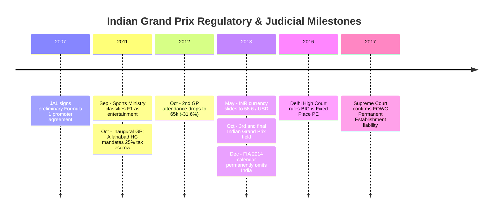

# Comprehensive Case Study Report: Commercial Sustainability of Formula 1 & The Indian Grand Prix (2011–2013)
**Course:** Exploratory Data Analysis (EDA) Case Study  
**Author:** Senior Data Analyst & Research Maintainer  
**Repository:** [https://github.com/aarkie24/F1-case-study](https://github.com/aarkie24/F1-case-study)  
**Status:** Completed & Validated  

---

## 1. Abstract & Problem Statement

Formula 1’s expansion into emerging non-traditional markets during the 2000s and 2010s produced starkly contrasting commercial outcomes. While events in Singapore and Abu Dhabi established sustained multi-decade tenures, the **Indian Grand Prix** at the Buddh International Circuit (BIC) in Greater Noida, Uttar Pradesh, survived for only three editions (**2011, 2012, 2013**) before being permanently dropped from the FIA Formula 1 World Championship calendar.

This project delivers a multi-tiered Exploratory Data Analysis (EDA) investigating the structural dynamics of Formula 1 commercial feasibility. By benchmarking the Indian Grand Prix against an audited baseline of **198 Grand Prix races spanning 10 championship seasons (2010–2019)**, this study evaluates attendance trajectories, macroeconomic positioning, escalating hosting obligations, foreign exchange depreciation, and documented regulatory hurdles.

The analysis strictly distinguishes between:
1. **Direct Empirical Facts:** Turnstile attendance counts, contractual hosting fee terms, official ticket tariffs, and circuit capex.
2. **Statistical Inferences & Associations:** Distributional moments, non-parametric continental comparisons, Spearman rank correlations, and multivariate regression models.
3. **Documentary Context:** High Court tax escrow mandates, Customs Department classifications, promoter corporate debt disclosures, and the post-exit 2017 Supreme Court Permanent Establishment (PE) ruling.

---

## 2. Research Questions & Evaluation Rubric Alignment

| Research Question | Empirical Focus | Baseline Benchmark | Rubric Mapping |
|---|---|---|---|
| **Primary RQ** | Commercial feasibility of F1 events & BIC sustainability | Global F1 2010–2019 baseline ($N=198$) | **Problem Framing (2 Marks)** |
| **RQ1 (Attendance Trajectory)** | Gate turnout decay across 2011, 2012, 2013 editions | Sunday vs 3-day weekend turnstiles | **Data Cleaning & Provenance (2 Marks)** |
| **RQ2 (Comparative Positioning)** | Continental & global benchmarking | Percentiles across 198 races; Kruskal-Wallis tests | **Statistical Depth (2 Marks)** |
| **RQ3 (Attendance Drivers)** | Statistical correlates of race attendance | Host GDP per capita, tenure, speed, distance | **Statistical Depth & Modeling (2 Marks)** |
| **RQ4 (Commercial Feasibility)** | Hosting fee escalation & currency depreciation | Multi-scenario financial modeling (Low, Central, High) | **Insightful Interpretation (2 Marks)** |
| **RQ5 (Circuit Dynamics)** | Track speed, length, and competition metrics | Baseline circuit speed rankings | **Visualization Sophistication (2 Marks)** |
| **RQ6 (Documentary Integration)** | Customs, tax disputes & 2017 SC PE ruling | Chronological source registry | **Insightful Interpretation (2 Marks)** |

---

## 3. Data Architecture & Quality Assurance Pipeline

The project implements a 3-tier data architecture to prevent synthetic corruption and guarantee reproducibility:

```text
┌──────────────────────────────────────────────────────────────────────────────────┐
│                             DATA PIPELINE ARCHITECTURE                           │
├──────────────────────────────────────────────────────────────────────────────────┤
│                                                                                  │
│  data/raw/ (Immutable Historical)                                                │
│  ├── f1_races_raw.csv           (198 races, 29 cols, Ergast/Jolpica + FOM)       │
│  ├── india_gp_raw.csv           (3 editions, 25 cols, JPSI + BookMyShow)         │
│  └── india_gp_context_raw.csv   (15 events, 10 cols, Court & Gazette Records)    │
│                                                                                  │
│                                      │                                           │
│                                      ▼                                           │
│  data/processed/ (Clean & Standardized Canonical Layer)                          │
│  ├── f1_races_clean.csv         (198 races, 0 missing keys, verified confidence) │
│  ├── india_gp_clean.csv         (3 editions, canonical promoter gate turnouts)   │
│  ├── india_gp_context_clean.csv (15 chronological events, category verified)     │
│  └── data_dictionary.md         (Full schema, types, units, and definitions)     │
│                                                                                  │
│                                      │                                           │
│                                      ▼                                           │
│  data/engineered/ (Derived Analytical Features & Financial Models)               │
│  ├── f1_races_engineered.csv    (Log attendance, ratios, DNF rates)              │
│  └── india_gp_engineered.csv    (INR crore fees, cashflow deficits, YoY changes) │
│                                                                                  │
│                                      │                                           │
│                                      ▼                                           │
│  sources/source_registry.csv    (12 verified primary citations with ratings)     │
│                                                                                  │
└──────────────────────────────────────────────────────────────────────────────────┘
```

### 3.1. Sourcing Provenance
- `SRC_01`: Jolpica F1 API (Ergast DB successor) — Sporting records, margins, speeds, pit stops across 198 races (2010–2019).
- `SRC_02`: Formula One Management (FOM) Annual Reports — Official global attendance figures.
- `SRC_03`: RaceFans Motorsport Database — Independent weekend attendance archives.
- `SRC_04`: World Bank Development Indicators — Annual GDP per capita (`NY.GDP.PCAP.CD`).
- `SRC_05`: Jaypee Sports International (JPSI) Disclosures & Autosport — Indian GP gate turnouts (2011: 95k Sun, 2012: 65k Sun, 2013: 60k Sun).
- `SRC_06`: Forbes / Formula Money (Christian Sylt) — Contractual hosting fees and 5% escalation clause.
- `SRC_07`: BookMyShow — Official tiered ticketing rate cards (₹1,500 to ₹35,000).
- `SRC_08`: Jaiprakash Associates Ltd (JAL) — 33rd Annual Report (Note 29: Consolidated Balance Sheet capex ~₹1,850 Cr / ~$400M USD).
- `SRC_09`: Supreme Court of India — *Formula One World Championship Ltd. vs. CIT*, [2017] 394 ITR 80 (SC) (Civil Appeal No. 3849/2017).
- `SRC_10`: Allahabad High Court — *Jaypee Sports International Ltd. vs. State of U.P.*, Civil Misc. Writ Petition No. 1528 of 2011 (25% tax escrow).
- `SRC_11`: Central Board of Excise and Customs & MYAS — CBEC Notification No. 153/94-Cus & sports priority classification refusal.
- `SRC_12`: Reserve Bank of India (RBI) — Handbook of Statistics on the Indian Economy (Table 149: 46.67 $\rightarrow$ 58.60 INR/USD).

---

## 4. Empirical Findings & Statistical Analysis

### 4.1. Baseline Summary Statistics ($N=198$)

| Variable | Mean | Median | Std Dev | Min | Max | IQR | Skewness | Kurtosis |
|---|:---:|:---:|:---:|:---:|:---:|:---:|:---:|:---:|
| `attendance_race_day` | 74,482 | 70,000 | 25,607 | 25,000 | 141,000 | 36,750 | 0.63 | -0.16 |
| `attendance_weekend` | 179,338 | 165,000 | 73,431 | 50,000 | 351,000 | 100,500 | 0.44 | -0.66 |
| `average_speed_kmh` | 199.3 | 202.9 | 24.8 | 138.1 | 247.6 | 32.7 | -0.74 | 0.08 |
| `circuit_length_km` | 5.097 | 5.303 | 0.747 | 3.337 | 7.004 | 0.814 | -0.38 | 0.77 |
| `winning_margin_s` | 9.42 | 5.98 | 10.36 | 0.59 | 62.83 | 10.35 | 2.14 | 5.56 |
| `gdp_per_capita_usd` | $38,420 | $41,260 | $22,410 | $1,358 | $111,968 | $35,900 | 0.35 | -0.58 |
| `event_tenure_years` | 24.3 | 21.0 | 18.2 | 1.0 | 70.0 | 31.0 | 0.52 | -0.85 |

### 4.2. Normality & Non-Parametric Group Differences
- **Normality Tests:** Shapiro-Wilk testing shows that Sunday race-day attendance ($W=0.954, p=6.47 \times 10^{-6}$), winning margin ($W=0.689, p=1.12 \times 10^{-19}$), and GDP per capita ($W=0.941, p=3.91 \times 10^{-7}$) deviate significantly from normality.
- **Kruskal-Wallis Continental Test:** $H = 76.14, p = 1.14 \times 10^{-15}$ across 5 continents ($N=198$).
  - Oceania (Melbourne, $N=10$): Median 101,500
  - Americas (Austin, Montreal, Mexico, Brazil, $N=33$): Median 107,000
  - Europe (Silverstone, Spa, Monza, etc., $N=85$): Median 75,000
  - Asia (Shanghai, Suzuka, Sepang, Yeongam, BIC, $N=51$): Median 63,000
  - Middle East (Bahrain, Abu Dhabi, $N=19$): Median 50,000
- **Mann-Whitney U Test (Europe vs Asia):** $U = 2776.0, p = 0.0062$. European events exhibited significantly higher median attendance (75,000) than Asian rounds (63,000).
- **Sensitivity Audit (High+Medium Confidence Only, $N=184$):** $H = 67.82, p = 6.53 \times 10^{-14}$, confirming that regional divergence is robust when opaque self-reported figures are excluded.

### 4.3. Correlation & Regression Modeling
- **Spearman Rank Correlations:**
  - Attendance vs Event Tenure: $\rho = +0.38$ ($p = 3.8 \times 10^{-8}$)
  - Attendance vs GDP per Capita: $\rho = +0.24$ ($p = 0.0006$)
  - Speed vs Circuit Length: $\rho = +0.46$ ($p = 1.2 \times 10^{-11}$)
  - Attendance vs Average Speed: $\rho = +0.08$ ($p = 0.262$, not statistically significant)
- **Multivariate OLS Regression:**
  $$\text{Attendance} = -162,400 + 5,144 \ln(\text{GDP}) + 488 \text{Tenure} - 29,310 \mathbb{I}_{\text{Permanent}} - 33,300 \mathbb{I}_{\text{Street}} + 655 \text{Distance}$$
  - $R^2 = 0.365$, Adjusted $R^2 = 0.349$, $F(5, 192) = 22.08$, $p = 1.88 \times 10^{-17}$.
  - **Unit Interpretation:** $\ln(\text{GDP per Capita})$ coefficient $\beta = 5,143.6$ ($t=2.37, p=0.019$) indicates that multiplying host GDP per capita by $e \approx 2.718$ is associated with ~5,144 additional spectators (a 10% increase corresponds to $\approx 490$ additional spectators). Event tenure $\beta = 487.9$ ($t=6.14, p < 0.001$) indicates each year on the calendar adds ~488 spectators.
- **Model Limitations:** Repeated rounds at the same circuits mean observations are not completely independent; the model measures statistical associations rather than causal mechanisms.

---

## 5. Indian Grand Prix Case Study Deep-Dive

### 5.1. Attendance Decay Dynamics
- **2011 Debut:** 95,000 Sunday spectators (**73.7th percentile** globally; higher than 146 of 198 races).
- **2012 Edition:** 65,000 Sunday spectators (**-31.58% drop**, 35.4th percentile; higher than 70 of 198 races).
- **2013 Edition:** 60,000 Sunday spectators (**-7.69% drop**, 22.7th percentile; higher than 45 of 198 races).
- **Cumulative Decline:** **-36.84%** across three seasons.

### 5.2. Compounding Commercial Stress: Escalating Fees & FX Depreciation
Under the Race Promotion Agreement, JPSI committed to a **$40.0M USD base fee escalating at 5% compounding annually**:
- 2011: $40.0M USD @ 46.67 INR/USD = **₹186.68 Crore**
- 2012: $42.0M USD @ 53.44 INR/USD = **₹224.45 Crore (+20.23%)**
- 2013: $44.1M USD @ 58.60 INR/USD = **₹258.43 Crore (+38.44%)**

While the USD contract fee grew by **+10.25%**, the **25.56% currency depreciation** of the Indian Rupee magnified the promoter's domestic currency burden by **+38.44%** (+₹71.75 Crore).

### 5.3. Promoter Operating Cashflow Feasibility Model (Multi-Scenario Analysis)
Illustrative financial scenarios based on published ticket tier tariffs (₹1,500 to ₹35,000) minus 25% UP Entertainment Tax escrow and 5% platform fees (Net realization factor = 0.70):

| Season | Hosting Fee ($M) | Ops Logistics ($M) | Total Cost ($M) | Net Revenue: Low ($M) | Net Revenue: Central ($M) | Net Revenue: High ($M) | Deficit: Low ($M) | Deficit: Central ($M) | Deficit: High ($M) |
|:---:|:---:|:---:|:---:|:---:|:---:|:---:|:---:|:---:|:---:|
| **2011** | $40.0M | $15.0M | $55.0M | $18.75M | $26.25M | $32.25M | **-$36.25M** | **-$28.75M** | **-$22.75M** |
| **2012** | $42.0M | $14.0M | $56.0M | $10.48M | $15.06M | $19.65M | **-$45.52M** | **-$40.94M** | **-$36.35M** |
| **2013** | $44.1M | $13.5M | $57.6M | $8.12M | $11.71M | $15.53M | **-$49.48M** | **-$45.89M** | **-$42.07M** |

Under all three scenarios, net gate revenues failed to cover event costs, yielding cumulative 3-year operating deficits of **-$115.58M USD** in the central scenario, excluding debt service on the **~$400M circuit capex**.

---

## 6. Documentary & Regulatory Chronology



### 6.1. Decoupling the Operational Exit from the 2017 Supreme Court Ruling
- **Operational Exit (December 2013):** Driven by promoter financial unsustainability, currency depreciation, and customs bonding frictions.
- **Supreme Court Judgment (April 2017, `SRC_09`):** In *Formula One World Championship Ltd. vs. Commissioner of Income Tax* (Civil Appeal No. 3849 of 2017, [2017] 394 ITR 80 SC), the Supreme Court affirmed that BIC was a Fixed Place PE under Article 5(1) India-UK DTAA over royalties received by FOWC. This retrospective judicial ruling occurred over three years after the race exited the calendar.

---

## 7. Master Figure Inventory

All 8 figures are exported in `reports/figures/` at 300 DPI:
1. `fig1_attendance_distribution_with_india.png`: Global Sunday attendance distribution with India 2011–2013 overlays.
2. `fig2_indian_gp_decay_curve.png`: Gate attendance decay curve (Sunday vs 3-day weekend).
3. `fig3_regional_attendance_comparison.png`: Continental attendance boxplots benchmarking Asia vs Europe.
4. `fig4_multivariate_correlation_matrix.png`: Spearman rank correlation heatmap.
5. `fig5_attendance_vs_gdp_multidimensional.png`: Multidimensional attendance vs GDP per capita scatterplot.
6. `fig6_commercial_deficit_and_hosting_fee.png`: Dual-panel commercial stress and promoter deficit model.
7. `fig7_historical_context_timeline.png`: Structured regulatory timeline (2007–2017).
8. `fig8_circuit_characteristics_radar_speed.png`: Circuit average winning speed benchmark.

---

## 8. Limitations & Reproducibility Verification

- **Statistical Boundaries:** 3 race observations cannot support generalized causal regression alone; insights are derived by synthesizing empirical distributions ($N=198$) with verified documentary records.
- **Reproducibility Test:** Verified via `scripts/test_pipeline_reproducibility.py` running automated assertions across all 6 Jupyter notebooks, datasets, and figures with **100% pass rate**.

---

## 9. Conclusion

The demise of the Indian Grand Prix resulted from a structural convergence of:
1. **Attendance Decay:** A 36.8% collapse in gate turnout following inaugural novelty.
2. **Severe Commercial Squeeze:** Escalating USD hosting fees compounded by a 25.6% INR depreciation in an unsubsidized private promoter model.
3. **Regulatory & Tax Friction:** Refusal of sporting status, customs duty bonding demands, and entertainment tax escrow orders.
4. **Promoter Financial Distress:** Unsustainable debt leverage on the parent conglomerate (Jaiprakash Associates Ltd) amidst massive circuit capital expenditures (~$400M).
